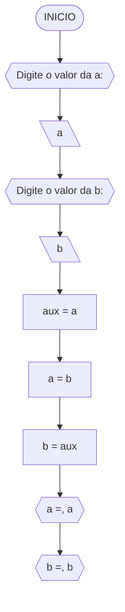
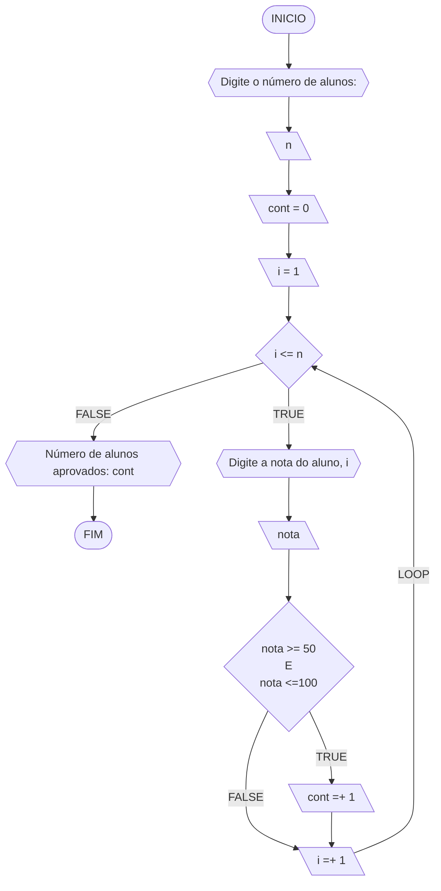
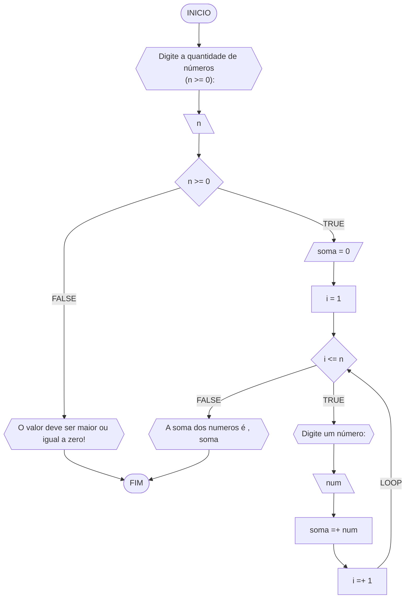
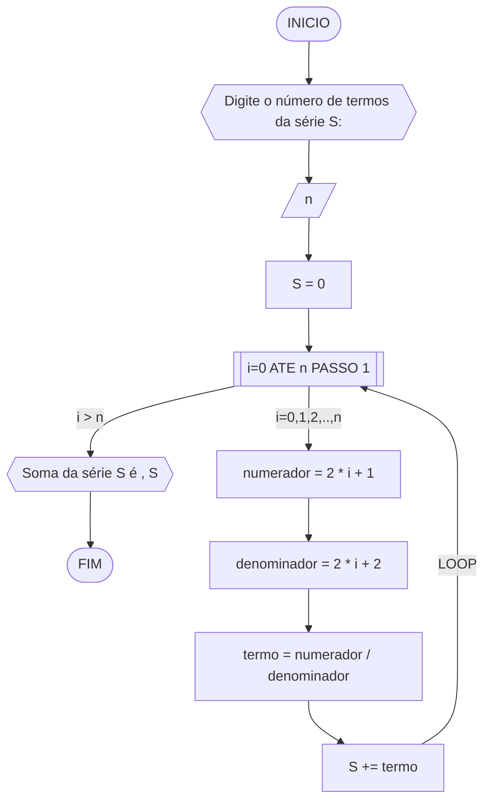
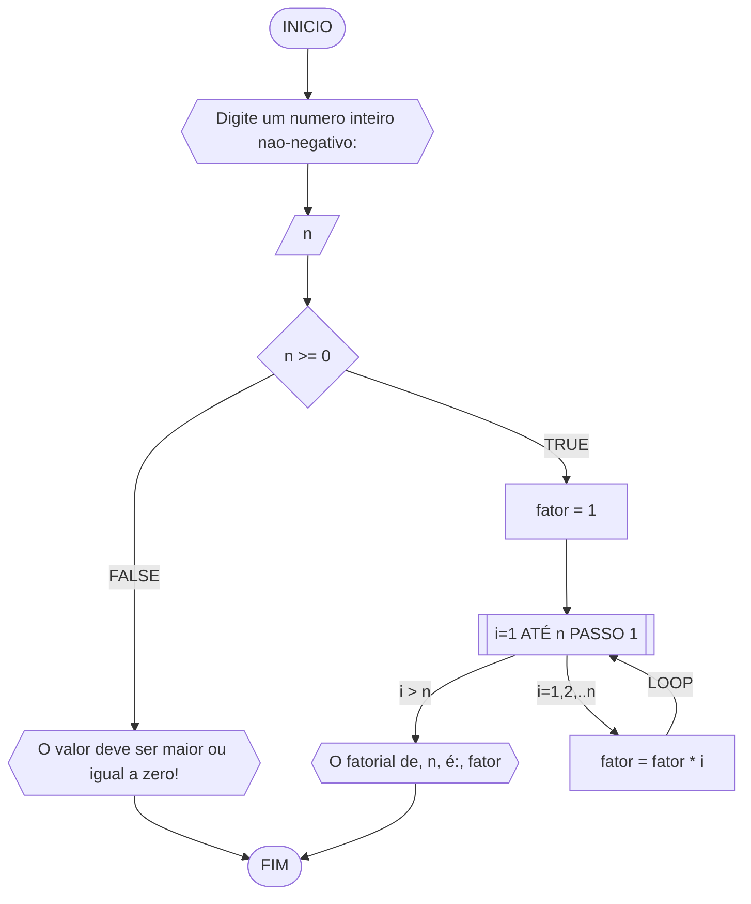
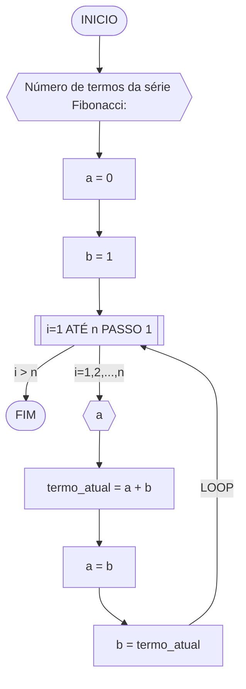
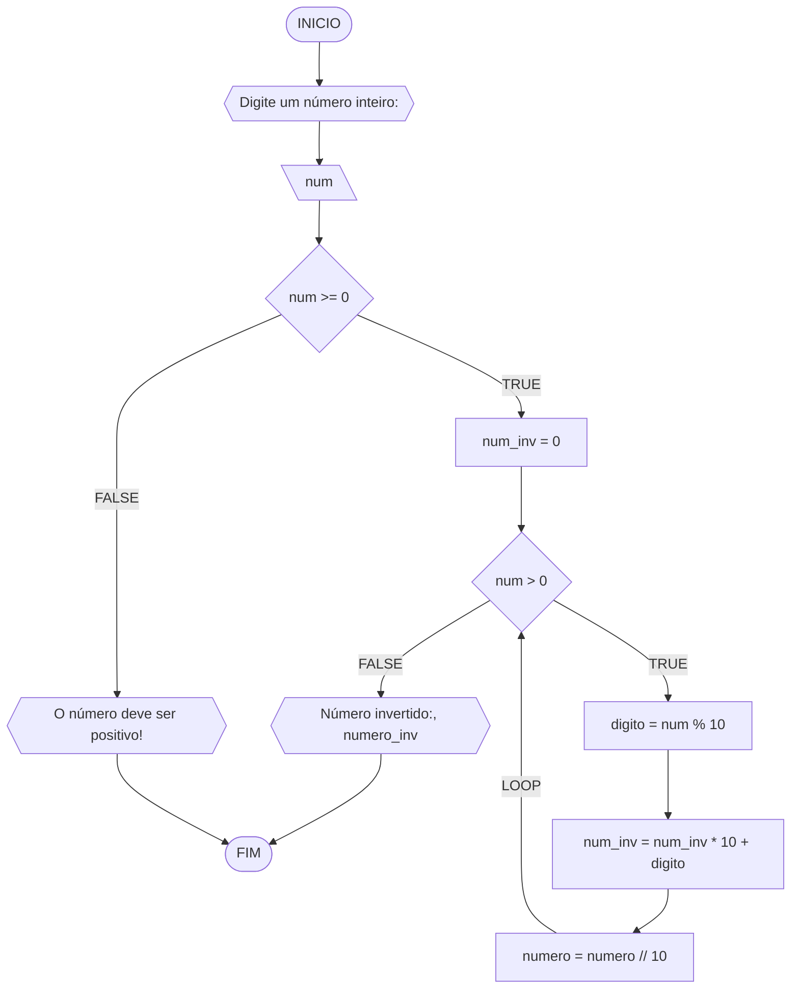

**Curso:** engenharia da computação <br>
**Disciplina:** raciocínio lógico e algoritmíco <br>
**Código/Turma:** T998-9 <br>
**Professor:** Ricardo Carubbi <br>
**Data:** 21/03/24 <br>
**Aluno(a):** Pedro Tomé Saldanha Lopes <br>
**Matrícula:** 2410307 <br>

**1a chamada (Sim/Não):** preencha com a opção correta <br>
**2a chamada (Sim/Não):** preencha com a opção correta

# Avaliação Diagnóstica 1

## Normas e exigências

Avaliação diagnóstica (**AD**) consiste em exercícios ou projetos desenvolvidos em grupo ao longo da disciplina. <br>
A primeira avaliação diagnóstica (**AD1**) será composta por exercícios e equivale a 30% da nota da primeira avaliação (**AV1**).

Segue abaixo a expressão para o cálculo da **AV1**, sendo sendo **AF1** equivale a primeira avaliação formativa e **AD1**, a primeira avaliação diagnóstica.

$$AV_1 = AF_1 \times 0,30 + AD_1 \times 0,70$$

A **AD1** é formada pela entrega dos exercícios (**EX1**) na data prevista e apresentação (**AP1**) de um dos exercícios escolhido pelo professor.
Segue abaixo a expressão para o cálculo da **AD1**.

$$AD_1 = (EX1_1 + AP_1)/2 $$

A **EX1** é avaliada mediante a **correção dos exercícios**, sendo a avaliação no intervalo de 0% (não atende a questão), 50% (atende parcialmente) e 100% (atende em sua totalidade).
Por exemplo, se o exercício equivale a 2 pontos e sua correção atente parcialmente a questão, então sua avaliação deste exercício será 1 ponto.

A **AP1** é avaliada mediante aos pré-requisitos de **clareza, organização e domínio do conteúdo**. Portanto, o aluno deve demonstrar um bom entendimento do algoritmo, explicando seus princípios fundamentais, seu propósito e como ele funciona passo a passo. <br>

A avaliação da **AP1** é apenas considerada no intervalo de 0% (não atende os pré-requisitos), 50% (atende parcialmente) e 100% (atende em sua totalidade).
Por exemplo, se na apresentação do exercício, o aluno atenter parcialmente os pré-requisitos, então sua avaliação da apresentação será 5,0.

## Datas
- Entrega da primeira avaliação formativa (**AF1**) composta pelas listas de exerciícios 1, 2 e 3: 21/03/24
- Entrega dos exercícios da primeira avaliação diagnóstica (**EX1**): 21/03/24
- Apresentação da primeira avaliação diagnóstica (**AP1**): 21/03/24

## Lista de questões

### Questão 1 - Troca dos valores de duas variáveis (1 ponto)

Dadas duas variáveis, $a$ e $b$, implemente e teste um algoritmo para trocar os valores atribuídos a elas.
#### Fluxograma (0.25 ponto)



#### Pseudocódigo (0.5 ponto)

```java
ALGORTIMO TrocaValores
DECLARE a,b,axu: REAL

INICIO

    // Dados de entrada do usuário, armazenados em uma variável "a"
    ESCREVA "Digite o valor da a:"

    // Dados da variável armazenados
    LEIA a

    // Insira seu comentário
    ESCREVA "Digite o valor da b:"

    // Insira seu comentário
    LEIA b

    // Insira seu comentário
    aux <- a 

    // Insira seu comentário
    a <- b

    // Insira seu comentário
    b <- aux

    // Insira seu comentário
    ESCREVA "a=", a
    ESCREVA "b=", b

FIM
```


#### Teste de mesa (0.25 ponto)

| a  | b  | aux | a  | b  | saída 1 | saída 2 | 
| -- | -- | --  | -- | -- | --      | --      | 
| 0  | 1  | 0   | 1  | 0  | a = 1   | b = 0   |

### Questão 2 - Contagem (1 ponto)

Dado um conjunto $n$ de notas de alunos em um exame, implemente e teste um algoritmo para fazer uma contagem $cont$ do número de alunos que foram aprovados no exame. 
Será considerado aprovado o aluno que tirar $nota$ 50 ou maior (no intervalo de 0 a 100).

#### Fluxograma (0.25 ponto)



#### Pseudocódigo (0.5 ponto)

```java
ALGORTIMO ContaAprovacoes
DECLARE n, cont, nota, i: INTEIRO

INICIO

    // Insira seu comentário
    ESCREVA "Digite a quantidade de notas dos alunos:"

    // Insira seu comentário
    LEIA n

    // Insira seu comentário
    cont = 0 

    // Insira seu comentário
    PARA i DE 1 ATE n FAÇA

        // Insira seu comentário
        ESCREVA "Digite a nota do aluno", i, ":"

        // Insira seu comentário
        LEIA nota

        // Insira seu comentário
        SE nota >= 50 E nota <= 100 ENTAO

            // Insira seu comentário
            cont = cont + 1 

        FIM_SE

    FIM_PARA

    // Insira seu comentário
    ESCREVA "O numero de alunos aprovados e:", cont

FIM
```


#### Teste de mesa (0.25 ponto)

| it | n  | i  | cont | i<=n  | nota, i | nota | nota_valida | cont+1 | i+1 | saída        | 
| -- | -- | -- | --   | --    | --      | --   | --          | --     | --  | --           |
| 1  | 3  | 1  |  0   | True  | nota 1  | 60   | True        | 1      | 2   |              |
| 2  | 3  | 2  |  1   | True  | nota 2  | 40   | False       | 1      | 3   |              |
| 3  | 3  | 3  |  1   | True  | nota 3  | 90   | True        | 2      | 4   |              |
| 4  | 3  | 4  |  2   | False |         |      |             |        |     | Aprovados: 2 |

### Questão 3 - Soma de um conjunto de números (1 ponto)

Dado um conjunto de $n$ números, implemente e teste um algoritmo para calcular a soma desses números. <br>
Aceite apenas $n$ maior ou igual a zero.

#### Fluxograma (0.25 ponto)



#### Pseudocódigo (0.5 ponto)

```java
Algoritmo SomaNumeros
DECLARE n,i,soma: INTEIRO

INICIO

    // Insira seu comentário
    ESCREVA "Digite a quantidade de números<br> (n >= 0):"
    LEIA n

    // Insira seu comentário
    SE n >=0 ENTAO

        // Insira seu comentário
        soma <- 0

        // Insira seu comentário
        i <- i

        // Insira seu comentário
        ENQUANTO i <= n FAÇA

            // Insira seu comentário
            ESCREVA "Digite um número:"

            // Insira seu comentário
            LEIA num 

            // Insira seu comentário
            soma <- soma + num

            // Insira seu comentário
            i <- i + 1

        FIM_ENQUANTO

    // Insira seu comentário
    SENAO
        "O valor deve ser maior ou igual a zero!"

    FIM_SE

    // Insira seu comentário
    ESCREVA "A soma dos numeros é , soma"

FIM
```

#### Teste de mesa (0.25 ponto)

| it | n  | n >= 0 | soma | i  | i <= n | num | soma =+ num  | saída                   |
| -- | -- | --     | --   | -- | --     | --  | --           | --                      |
|    | -3 | False  |      |    |        |     |              | O valor deve ser ...    |
| 1  | 0  | True   | 0    | 1  | False  |     |              | A soma dos números é 0  |
| 1  | 3  | True   | 0    | 1  | True   | 5   | 0 + 5 = 5    |                         |
| 2  | 3  | True   | 5    | 2  | True   | 10  | 5 + 10 = 15  |                         |
| 3  | 3  | True   | 15   | 3  | True   | 20  | 15 + 20 = 35 |                         |
| 4  | 3  | True   | 35   | 4  | False  |     |              | A soma dos números é 35 |


### Questão 4 - Cálculo de uma série (1 ponto)

Dado um conjunto de $n$ termos da série, implemente e teste um algoritmo para calcular o valor de S, conforme definido abaixo:

$$ S = \frac{1}{2} + \frac{3}{4} + \frac{5}{6} + \frac{7}{8} + \dots $$

#### Fluxograma (0.25 ponto)



#### Pseudocódigo (0.5 ponto)

```java
Algoritmo SomaSerie
DECLARE n,numerador,denominador: INTEIRO; termo, S: REAL

INICIO

    // Insira seu comentário
    ESCREVA "Digite o número de termos da série S:"

    // Insira seu comentário
    LEIA n

    // Insira seu comentário
    S <- 0

    // Insira seu comentário
    PARA i de 0 ATÉ n-1 PASSO 1 FAÇA

        // Insira seu comentário
        numerador = 2 * i + 1

        // Insira seu comentário
        denominador <- 2 * i + 2

        // Insira seu comentário
        termo = numerador / denominador

        // Insira seu comentário
        S += termo

    FIM_PARA

    // Insira seu comentário
    ESCREVA "Soma da série S é ", S

FIM
```

#### Teste de mesa (0.25 ponto)

| it | n  | S  | i | numerador | denominador | termo | S += termo     | saída                  |
| -- | -- | -- |-- | --        | --          | --    | --             | --                     |
|    | 0  | 0  |   |           |             |       |                |                        |
| 1  | 4  | 0  | 0 | 2*0+1 = 1 | 2*0+2 = 2   | 1/2   | 0+1/2 = 1/2    |                        |
| 2  | 4  | 0  | 1 | 2*1+1 = 1 | 2*1+2 = 2   | 3/4   | 1/2+3/4 = 1.25 |                        |
| 3  | 4  | 0  | 2 | 2*2+1 = 1 | 2*2+2 = 2   | 5/6   | 0+1/2 = 2.08   |                        |
| 4  | 4  | 0  | 3 | 2*3+1 = 1 | 2*3+2 = 2   | 7/8   | 0+1/2 = 2.96   | Soma da série S é 2.96 |

### Questão 5 - Cálculo fatorial (2 pontos)

Dado um número $n$, implemente e teste um algoritmo para calcular o fatorial de $n$ (escrito como $n!$), onde $n ≥ 0$.

#### Fluxograma (0.5 ponto)



#### Pseudocódigo (1.0 ponto)

```java
ALGORITMO CalcFatorial
DECLARE n: INTEIRO

INICIO

    // Insira seu comentário
    ESCREVA "Digite um numero inteiro nao-negativo:"

    // Insira seu comentário
    LEIA n

    // Insira seu comentário
    SE n >= 0 ENTAO

        // Insira seu comentário
        fator <- 1

        // Insira seu comentário
        PARA i DE 1 ATÉ n PASSO 1 FAÇA

            // Insira seu comentário
            fator <- fator * i        // fator *= i

        FIM_PARA

        // Insira seu comentário
        ESCREVA "O fatorial de, n, é:", fator

    // Insira seu comentário
    SENAO
        ESCREVA "O valor deve ser maior ou igual a zero!"
    FIM_SE

FIM
```

#### Teste de mesa (0.5 ponto)

| n  | fator | i  | fator = fator * i | saída               |
| -- | --    | -- | --                | --                  |
| 3  | 1     | 1  | 1*1 = 1           |                     |
| 3  | 1     | 2  | 1*2 = 2           |                     |
| 3  | 2     | 3  | 2*3 = 6           | O fatorial de 3 é 6 |


### Questão 6 - Geração da sequência de Fibonacci (2 pontos)

Gerar e imprimir os $n$ primeiros termos da sequência de Fibonacci, onde $n ≥ 1$. <br>
Os primeiros termos são: $0, 1, 1, 2, 3, 5, 8, 13, \dots$ <br>
Cada termo, além dos dois primeiros, é derivado da soma dos seus dois antecessores mais próximos.

#### Fluxograma (0.5 ponto)


#### Pseudocódigo (1.0 ponto)

```java
ALGORITMO GeraFibonacci
DECLARE n, a, b, termo_atual: INTEIRO

INICIO

    // Insira seu comentário
    ESCREVA "Número de termos da série Fibonacci:"

    // Insira seu comentário
    LEIA n

    // Insira seu comentário
    a <- 0

    // Insira seu comentário
    b <- 1

    // Insira seu comentário
    PARA i DE 1 ATE n FAÇA

        // Insira seu comentário
        ESCREVA a

        // Insira seu comentário
        termo_atual <- a + b

        // Insira seu comentário
        a <- b

        // Insira seu comentário
        b <- termo_atual

    FIM_PARA
FIM

```

#### Teste de mesa (0.5 ponto)

| it | n  | a  | b  | i  | saída | termo_atual = a + b | a = b | b = termo_atual |
| -- | -- | -- | -- | -- | --    | --                  | --    | --              |
| 1  | 5  | 0  | 1  | 1  | 0     | 0 + 1 = 1           | 1     | 1               |
| 2  | 5  | 1  | 1  | 2  | 1     | 1 + 1 = 2           | 1     | 2               |
| 3  | 5  | 1  | 2  | 3  | 1     | 1 + 2 = 3           | 2     | 3               |
| 4  | 5  | 2  | 3  | 4  | 2     | 2 + 3 = 5           | 3     | 5               |
| 4  | 5  | 3  | 5  | 5  | 3     | 3 + 5 = 8           | 5     | 8               |

### Questão 7 - Inversão dos dígitos de um número inteiro (2 pontos)

Implemente e teste um algoritmo para inverter a ordem dos dígitos de um número inteiro positivo de dois dígitos.

#### Fluxograma (0.5 ponto)



#### Pseudocódigo (1.0 ponto)

```java
Algoritmo InverteInteiro
DECLARE num, num_inv, digito: INTEIRO

INICIO

    // Insira seu comentário
    ESCREVA "Digite o número a ser invertido:"
    LEIA num

    // Insira seu comentário
    SE num < 0 ENTAO

        // Insira seu comentário
        ESCREVA "O número deve ser positivo!"

    // Insira seu comentário
    SENAO

        // Insira seu comentário
        num_inv <- 0

        // Insira seu comentário
        ENQUANTO num > 0 FAÇA

            // Insira seu comentário
            digito <- num % 10

            // Insira seu comentário
            num_inv <- (num_inv * 10) + digito

            // Insira seu comentário
            num <- num // 10

        // Insira seu comentário
        ESCREVA "Número invertido:", num_inv

    FIM_SE

FIM
```


#### Teste de mesa (0.5 ponto)

| it | num | num_inv | num > 0 | digito | num = num // 10 | num_inv = (num_inv * 10) + digito | Saída                       |
| -- | --  | --      | --     | --      | --              | --                                | --                          |
|    | -1  | 0       | False  |         |                 |                                   | O número deve ser positivo! |
| 1  | 0   | 0       | False  |         |                 |                                   | Número invertido:: 0        |
| 1  | 42  | 0       | True   | 2       | 4               | 2                                 |                             |
| 2  | 4   | 2       | True   | 4       | 0               | 24                                |                             |
| 3  | 0   | 24      | False  |         |                 |                                   | Número invertido:: 24       |
