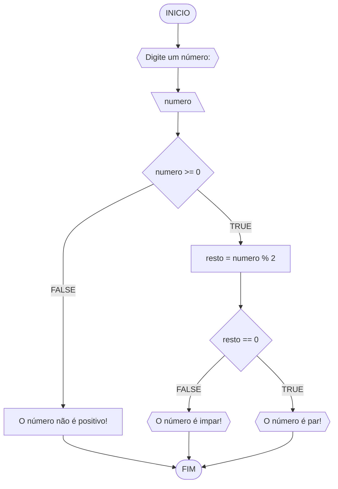
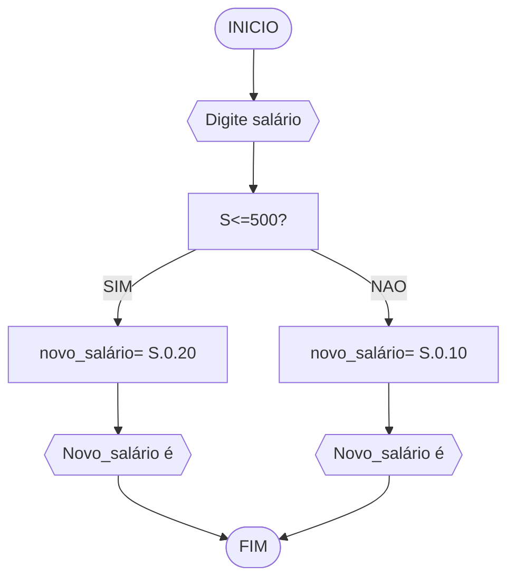
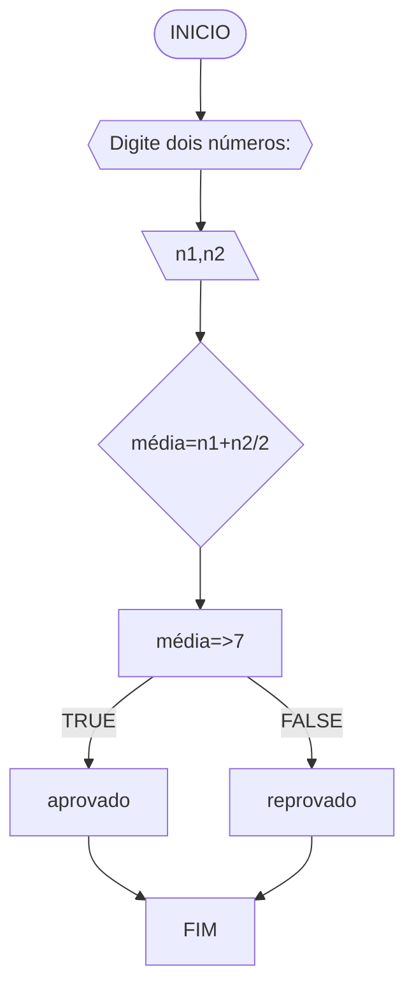
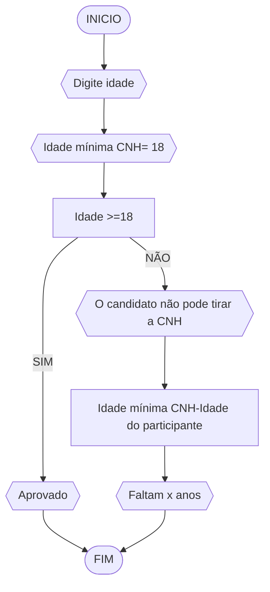

# UNIFOR
**Nome**: Pedro Tomé Saldanha Lopes <br>
**Disciplina**: Raciocínio lógico algorítmico

## Lista de exercícios 01

### Exercício 01 (1 ponto)
Represente, em fluxograma e pseudocódigo, um algoritmo para determinar se um número inteiro e positivo é par ou impar.

#### Fluxograma (0,25 ponto)



#### Pseudocódigo (0,5 ponto)
```
1  ALGORTIMO verifica_par_impar
2  DECLARE numero, resto: INTEIRO
3  ESCREVA "Digite um número: "
4  INICIO
4  LEIA numero
5  SE numero >= 0 ENTAO                  // verifica se o inteiro é positivo
6    resto = numero % 2                 // calcula o resto da divisão por 2
7    SE resto == 0 ENTAO                // verifica se o resto é igual a zero
8      ESCREVA "O número é par!"
9    SENAO
10     ESCREVA "O número é impar!"
11   FIM_SE
11  SENAO                                // caso inteiro for negativo (condição linha 5)
12    ESCREVA "O número deve ser postivo!"
13  FIM_SE
13 FIM
```

#### Teste de mesa (0,25 ponto)
| numero | numero >= 0 | resto | resto == 0 | Saída |
| -- | -- | -- | -- | -- | 
| -1 | F |   |   | "O número deve ser postivo!" |
| 0  | V | 0 | V | "O número é par!" |
| 13 | V | 1 | F | "O número é impar!" |
| 30 | V | 0 | V | "O número é par!" |

## Exercício 02 (3 pontos)
Represente, em fluxograma e pseudocódigo, um algoritmo para calcular o novo salário de um funcionário. 
Sabe-se que os funcionários que recebem atualmente salário de até R$ 500 terão aumento de 20%; os demais terão aumento de 10%.

#### Fluxograma (1.0 ponto)



#### Pseudocódigo (1.0 ponto)

```
Algoritmo NovoSalário
DECLARE S, númerico inteiro
ESCREVA "Digite salário atual"
INICIO
LEIA salário atual
SE s<=500 ENTÃO
 Novo_salário= S. 0.20
SENAO
 Novo_salário= S.0.10
FIM_SE
ESCREVA "O novo salário é ", novo_salário
FIM_ALGORITMO
```

#### Teste de mesa (1.0 ponto)

| Salário_atual | Reajuste| S=500 | S<500 | Saída | 
|      --      |      --      |      --      |      --      |      --      | 
| S<=500    | S=500= 20%       | S.0.20   |      | "O novo salário é"  |
| S<=500   | S<500= 10%         |        | S.0.10 | "O novo salário é" |


## Exercício 03 (3 pontos)
Represente, em fluxograma e pseudocódigo, um algoritmo para calcular a média aritmética entre duas notas de um aluno e mostrar sua situação, que pode ser aprovado ou reprovado.

#### Fluxograma (1 ponto)



#### Pseudocódigo (1 ponto)

```
ALGORITMO média_aritmetica
DECLARE n1,n2, númericos 
ESCREVA "digite dois números"
INICIO
LEIA N1,N2
DECLARE média= n1+n2/2
SE M=>7 ENTÃO
 ESCREVA "Aprovado" 
SENAO
 ESCREVA "Reprovado"
FIM_ALGORITMO
```

#### Teste de mesa (1 ponto)

| números | Média | Aprovado | Reprovado | Saída |
| -- | -- | -- | -- | -- | 
| N1 | M=>7 | n1+n2/2 =>7  |   | "Aprovado" |
| N2 | M=>7 | | N1+n2/2 <7 | "Reprovado" |

## Exercício 04 (3 pontos)
Represente, em fluxograma e pseudocódigo, um algoritmo que, a partir da idade do candidato(a), determinar se pode ou não tirar a CNH. 
Caso não atender a restrição de idade, calcular quantos anos faltam para o candidato estar apto.

#### Fluxograma (1.0 ponto)




#### Pseudocódigo (1.0 ponto)

```
Algoritmo ContaAprovacoes
DECLARE Idade, númerico
ESCREVA "Digite idade"
INICIO
LEIA idade
DECLARE Idade mínima CNH=18
SE Idade do participante(IP)>=18, ENTAO
 ESCREVA "Aprovado"
SENAO
 Anos_restantes= Idade mínima CNH(18)-Idade do participante
ESCREVA "Faltam tantos anos para tirar a carteira da CNH"
FIM_ALGORITMO
```

#### Teste de mesa (1.0 ponto)
| Idade do participante | Idade mínima CNH | Idade>=18 | Idade<18 | Saída | 
|      --      |      --      |      --      |      --      |      --      | 
| Idade x    | 18      |Aprovado  |       |  "O candidato pode tirar a CNH"   |
| Idade y  |  18       |        | 18-idade do participante | "O candidato não pode tirar a CNH"  |

