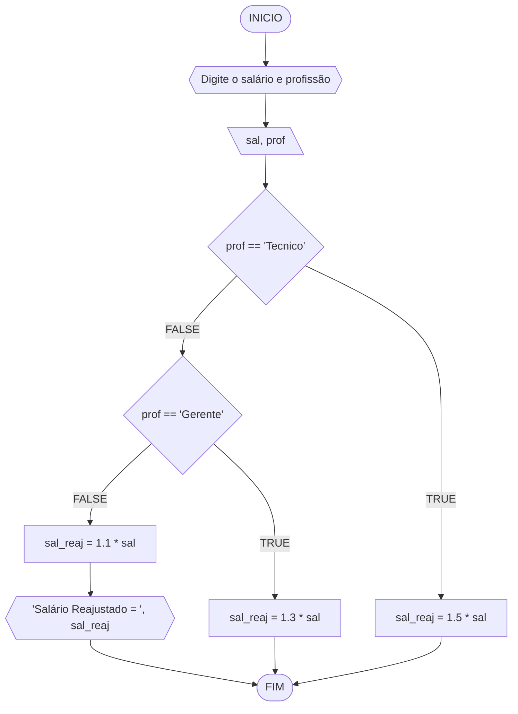
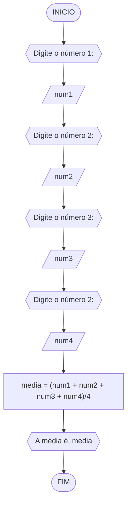
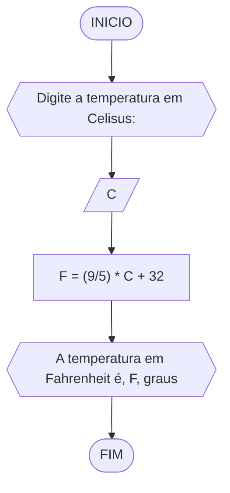
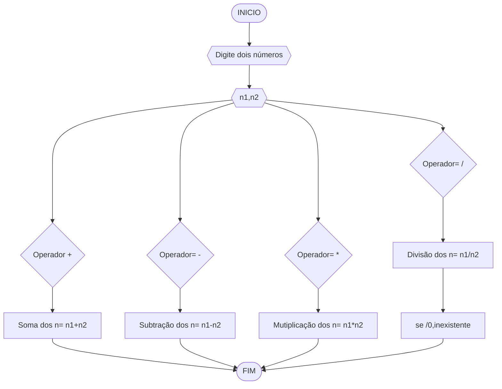
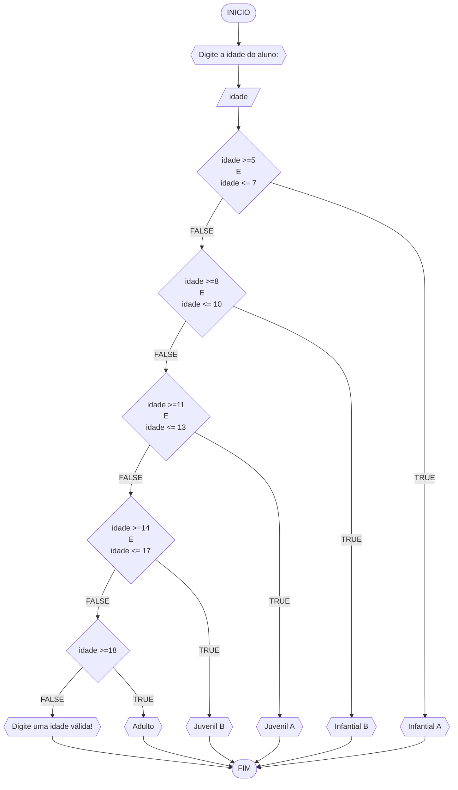

# UNIFOR
**Nome**: Pedro Tomé Saldanha Lopes <br>
**Disciplina**: Raciocínio lógico algorítmico

## Exercício exemplo
Represente, em fluxograma e pseudocódigo, um algoritmo para calcular o adicional de salário de funcionário por cargo de uma empresa fictícia. Sabe-se que os funcionários de cargo técnico receberão reajuste de 50%, cargo de gerência, um reajuste de 30% e demais, um reajuste de 10%. 

#### Fluxograma


#### Pseudocódigo
```
1  ALGORITMO calReajuste
2  DECLARE  sal, sal_reaj: real, prof: caractere
3  INICIO
4  LEIA sal, prof
5  ESCOLHA
6   CASO prof == “Técnico”		// caso 1
7     sal_reaj ← 1.5 * sal
8   CASO prof = “Gerente”		// caso 2
9     sal_reaj ← 1.3 * sal
10  SENÃO
11    sal_reaj ← 1.1 * sal
12 FIM_ESCOLHA
13 ESCREVA “Salário Reajustado = “, sal_reaj
14 FIM
```

#### Teste
| sal | prof | prof == “Técnico” | prof = “Gerente” | sal_reaj | Saída |
| -- | -- | -- | -- | -- | -- |
| 1000 | Técnico | V | F | 1500 | “Salário Reajustado = 1500“ |
| 2000 | Gerente | F | V | 2600 | “Salário Reajustado = 2600“ |
| 9000 | Diretor | F | F | 9900 | “Salário Reajustado = 9900“ |

## Lista de exercícios 02

### Exercício 01 (2.5 pontos)
Calcule a média de quatro números inteiros dados.

#### Fluxograma (1.0 ponto)



#### Pseudocódigo (1.0 ponto)

```java
ALGORTIMO Media
DECLARE num1, num2, num3, num4: REAL

INICIO

    // Instrução de atribuição para armazenar um dado númerico ao algoritmo
    ESCREVA "Digite o número 1:"

    // Instrução de entrada para armazenar um dado númerico ao algoritmo
    LEIA num1

    // Instrução de atribuição para armazenar um dado númerico ao algoritmo
    ESCREVA "Digite o número 2:"

    // Instrução de entrada para armazenar um dado númerico ao algoritmo
    LEIA num2

    // Instrução de atribuição para armazenar um dado númerico ao algoritmo
    ESCREVA "Digite o número 3:"

    // Instrução de entrada para armazenar um dado númerico ao algoritmo
    LEIA num3

    // Instrução de atribuição para armazenar um dado númerico ao algoritmo
    ESCREVA "Digite o número 4:"

    // Instrução de entrada para armazenar um dado númerico ao algoritmo
    LEIA num4

    // Instrução de atribuição onde, os dados dos números armazenados irão realizar uma média aritmética para obtenção dos resultados
    media <- (num1 + num2 + num3 + num4)/4
    ESCREVA "A média é", media

FIM
```


#### Teste de mesa (0.5 ponto)

 | num1 | num2 | num3 | num4 | saída | 
| --   | --   | --   | --   | --    | 
| 0.25 | 0.25 | 2.50 | 1.00 | 1.00  | 

### Exercício 02 (2.5 pontos)
Leia uma temperatura dada em Celsius (C) e imprima o equivalente em Fahrenheit (F). (Fórmula de conversão: F = (9/5) * C + 32)

#### Fluxograma (1.0 ponto)



#### Pseudocódigo (1.0 ponto)

```java
ALGORTIMO ConverteCelsiusFarenheit
DECLARE C, F: REAL

INICIO

    // 
    ESCREVA "Digite a temperatura em Celisus:"

    // Insira seu comentário
    LEIA C

    // Insira seu comentário
    F <- (9/5) * C + 32

    // Insira seu comentário
    ESCREVA "A temperatura em Fahrenheit é", F, "graus"

FIM
```

#### Teste de mesa (0.5 ponto)

| C  | F  | saída                                  | 
| -- | -- | --                                     |
| 0  | 32 | A temperatura em Fahrenheit é 32 graus |

### Exercício 03 (2.5 pontos)
Receba dois números reais e um operador e efetue a operação correspondente com os valores recebidos (operandos). 
O algoritmo deve retornar o resultado da operação selecionada simulando todas as operações de uma calculadora simples.

#### Fluxograma (1.0 ponto)



#### Pseudocódigo (1.0 ponto)

```
Algoritmo Calculadora
DECLARE n, númerico, real
ESCREVA "Digite dois números"
LEIA n1,n2
SE o operador for +, ENTAO
 CALCULE n1+n2
SE o operador for -, ENTAO
 CALCULE n1-n2
SE o operador for *, ENTAO
 CALCULE n1*n2
SE o operador for /, ENTAO
 CALCULE n1/n2
SE na divisão o denomiador for = 0, ENTÃO
 ESCREVA "Inexistente"
FIM_ALGORITMO
```

#### Teste de mesa (0.5 ponto)

| Número_real | Operador= + | Operador= - | Operador= * | Operador= / | n/0 |
| -- | -- | -- | -- | -- | -- |
| n1| n1+n2 | n1-n2 | n1*n2 | n1/n2 | "Inexistente" |
| n2 | n2+n1 | n2-n1 | n2*n1 | n2/n1 | “Inexistente“ |


### Exercício 04 (2.5 pontos)
Elaborar um algoritmo que, dada a idade, classifique nas categorias: infantil A (5 - 7 anos), infantil B (8 -10 anos), juvenil A (11 - 13 anos), juvenil B (14 -17 anos) e adulto (maiores que 18 anos).

#### Fluxograma (1.0 ponto)


#### Pseudocódigo (1.0 ponto)

```
ALGORTIMO ClassificaCategoria
DECLARE idade: INTEIRO

INICIO

    // Instrução de entrada ao algoritmo para armazenar um dado de entrada númerico
    ESCREVA "Digite a idade do aluno:"

    // 
    LEIA idade

    // Insira seu comentário
    ESCOLHA

        // Insira seu comentário
        CASO idade >=5 E idade <= 7

            // Insira seu comentário
            ESCREVA "Infantial A"

        // Insira seu comentário
        CASO idade >=8 E idade <= 10

            // Insira seu comentário
            ESCREVA "Infantial B"

        // Insira seu comentário
        CASO idade >=11 E idade <= 13

            // Insira seu comentário
            ESCREVA "Juvenil A"

        // Insira seu comentário
        CASO idade >=14 E idade <= 17

            // Insira seu comentário
            ESCREVA "Juvenil B"

        // Insira seu comentário
        CASO idade >=18

            // Insira seu comentário
            ESCREVA "Adulto"

    // Insira seu comentário
    SENAO

        // Insira seu comentário
        ESCREVA "Digite uma idade válida!"

    FIM_ESCOLHA

FIM
```


#### Teste de mesa (0.5 ponto)
| idade | idade >=8 E idade <= 10 | idade >=11 E idade <= 13 | idade >=14 E idade <= 17 | idade >=18 | saída                       | 
| --    | --                      | --                       | --                       | --         | --                          |
| 4     | False                   | False                    | False                    | False      | Digite uma idade válida!    |
| -4    | False                   | False                    | False                    | False      | Digite uma idade válida!    |
| 8     | True                    | False                    | False                    | False      | Infantial A                 |
| 11    | False                   | True                     | False                    | False      | Infantial B                 |
| 17    | False                   | False                    | True                     | False      | Infantial C                 |
| 21    | False                   | False                    | False                    | True       | Adulto                      |
