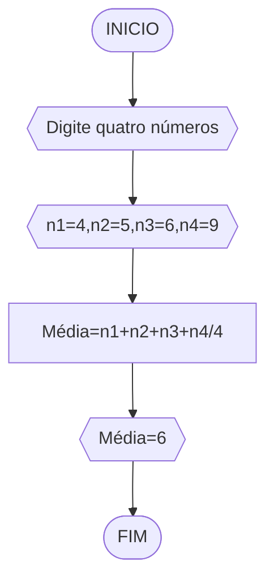
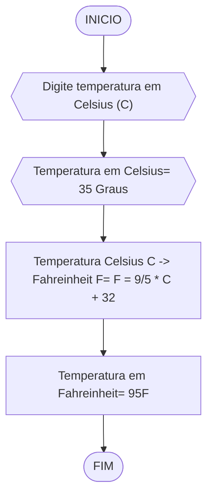
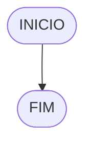
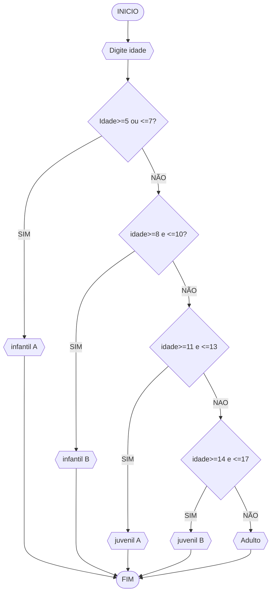

# UNIFOR
**Nome**: Nome do estudante <br>
**Disciplina**: Raciocínio lógico algorítm

## Exercício exemplo
Represente, em fluxograma e pseudocódigo, um algoritmo para calcular o adicional de salário de funcionário por cargo de uma empresa fictícia. Sabe-se que os funcionários de cargo técnico receberão reajuste de 50%, cargo de gerência, um reajuste de 30% e demais, um reajuste de 10%. 

#### Fluxograma


#### Pseudocódigo
```
1  ALGORITMO calReajuste
2  DECLARE  sal, sal_reaj: real, prof: caractere
3  INICIO
4  LEIA sal, prof
5  ESCOLHA
6   CASO prof == “Técnico”		// caso 1
7     sal_reaj ← 1.5 * sal
8   CASO prof = “Gerente”		// caso 2
9     sal_reaj ← 1.3 * sal
10  SENÃO
11    sal_reaj ← 1.1 * sal
12 FIM_ESCOLHA
13 ESCREVA “Salário Reajustado = “, sal_reaj
14 FIM
```

#### Teste
| sal | prof | prof == “Técnico” | prof = “Gerente” | sal_reaj | Saída |
| -- | -- | -- | -- | -- | -- |
| 1000 | Técnico | V | F | 1500 | “Salário Reajustado = 1500“ |
| 2000 | Gerente | F | V | 2600 | “Salário Reajustado = 2600“ |
| 9000 | Diretor | F | F | 9900 | “Salário Reajustado = 9900“ |

## Lista de exercícios 02

### Exercício 01 (2.5 pontos)
Calcule a média de quatro números inteiros dados.

#### Fluxograma (1.0 ponto)



#### Pseudocódigo (1.0 ponto)

```
Algoritmo Media
DECLARE n1,n2,n3,n4, númericos
ESCREVA "Digite quatro números"
INICIO
LEIA quatro números, n1=4,n2=5,n3=6,n4=9
CONSIDERE média= n1+n2+n3+n4/4
CALCULE a média, média=4+5+6+9/4= 6
ESCREVA média=6
FIM_ALGORITMO
```

#### Teste de mesa (0.5 ponto)

  | Números | Média | Cálculo_Média | Saída |  | 
|      --      |      --      |      --      |      --      |      --      | 
| n1=4,n2=5,n3=6,n4=9   |  M=n1+n2+n3+n4/4          |   M=4+5+6+9/4=       | "Média=6" |   |

### Exercício 02 (2.5 pontos)
Leia uma temperatura dada em Celsius (C) e imprima o equivalente em Fahrenheit (F). (Fórmula de conversão: F = (9/5) * C + 32)

#### Fluxograma (1.0 ponto)



#### Pseudocódigo (1.0 ponto)

```
Algoritmo ConverteCelsiusFarenheit
DECLARE Temperatura, númerico
ESCREVA "Digite temperatura em Celsius (C)"
INICIO
LEIA temperatura em Celsius (C°), C= 35 Graus
CALCULE a temperatura para Fahreinheit (F), usando o módulo: F= F = 9/5 * C + 32
LEIA temperatura em Fahreinheit
ESCREVA "Temperatura em Fahreinheit é 95F"
FIM_ALGORITMO
```

#### Teste de mesa (0.5 ponto)
| Temperatura em Celsius C° | Módulo temperatura em Fahreinheit F°  | Temperatura em Fahreinheit | Saída |  | 
|      --      |      --      |      --      |      --      |      --      | 
|
| 35° graus   |   F= F = 9/5 * C + 32  | 95°F | "Temperatura em Fahreinheit é 95F" |   |

### Exercício 03 (2.5 pontos)
Receba dois números reais e um operador e efetue a operação correspondente com os valores recebidos (operandos). 
O algoritmo deve retornar o resultado da operação selecionada simulando todas as operações de uma calculadora simples.

#### Fluxograma (1.0 ponto)



#### Pseudocódigo (1.0 ponto)

```
Algoritmo Calculadora
FIM_ALGORITMO
```

#### Teste de mesa (0.5 ponto)

| nome_coluna1 | nome_coluna2 | nome_coluna3 | nome_coluna4 | nome_coluna5 | 
|      --      |      --      |      --      |      --      |      --      | 
| Adicione     | espaço       | se quiser    |  alinhar     | as barras    |
| verticais,   | mas          | não é        | obrigatório. | Entendido ?  |

### Exercício 04 (2.5 pontos)
Elaborar um algoritmo que, dada a idade, classifique nas categorias: infantil A (5 - 7 anos), infantil B (8 -10 anos), juvenil A (11 - 13 anos), juvenil B (14 -17 anos) e adulto (maiores que 18 anos).

#### Fluxograma (1.0 ponto)



#### Pseudocódigo (1.0 ponto)

```
Algoritmo ClassificaCategoria
DECLARE idade inteiro, númerico
ESCREVA "Digite idade"
INICIO
LEIA idade
SE idade>=5 e <7, ENTAO
 ESCREVA "infantil A"
SENAO
 SE idade >=8 e <=10
 ESCREVA "infantil B"
SENAO
 SE idade >=11 e <=13
 ESCREVA "juvenil A"
SENAO
 SE idade >=14 e <=17
 ESCREVA "juvenil B"
SENAO 
 ESCREVA "adulto"
FIM_ALGORITMO
```

#### Teste de mesa (0.5 ponto)

| Idade>=5 e <=7 | >=8 e <=10| >=11 e <=13 | >=14 e <=17 | >=18 | 
|      --      |      --      |      --      |      --      |      --      | 
|  infantil A    | infantil B     | juvenil A   |  juvenil B     | Adulto    |
