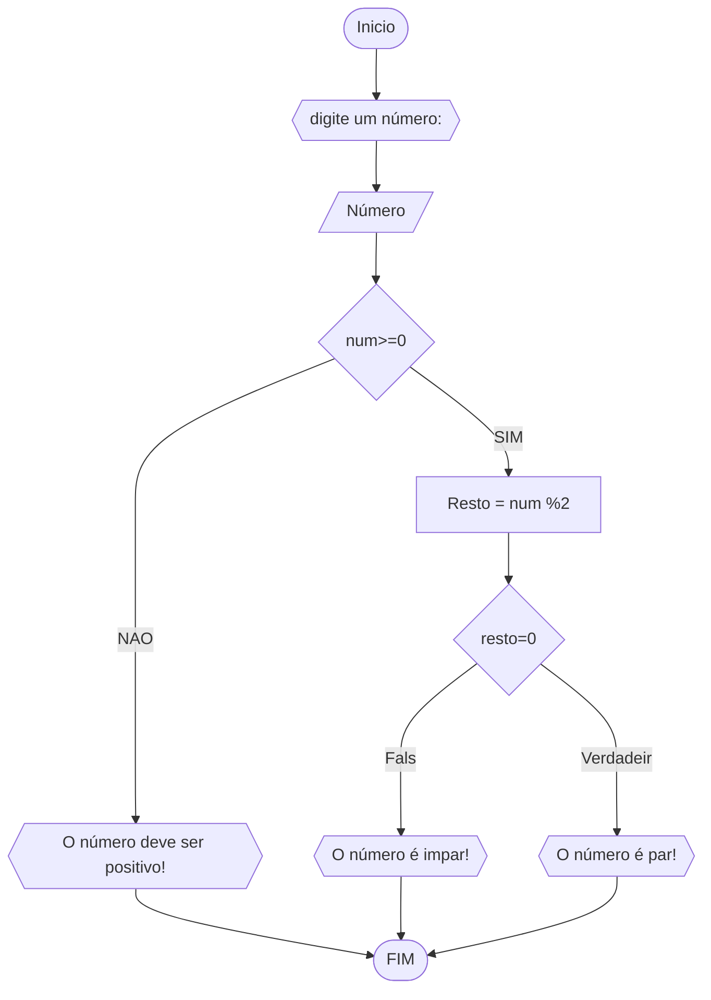

# UNIFOR
**Nome**: Pedro Tomé Saldanha Lopes <br>
**Disciplina**: Raciocínio lógico algorítmico 

## Lista de exercícios 01

###  Exercício 3
Represente em fluxograma, pseucódigo, um algoritmo para determinar um número inteiro e positivo é par ou impar.

#### Fluxograma



#### Pseudocódigo
```
ALGORITMO verifica_par_impar
DECLARE num: int, resto
INICIO
ESCREVA "Digite um número"
LEIA num
Se num >=0 ENTAO
	resto <- num %2
	SE resto == 0 ENTAO
		ESCREVA "o número é par!"
	SENAO 
		ESCREVA "O número é impar!"
	FIM_SE
SENAO
	ESCREVA "o número deve ser positivo!"
FIM_SE
FIM
```
#### Teste
| num | resto | num >=0 | resto ==0 | saída |
| -- |  -- |  -- |  -- |  -- | 
|  -1  | F |   |   | "O número deve ser positivo" |
